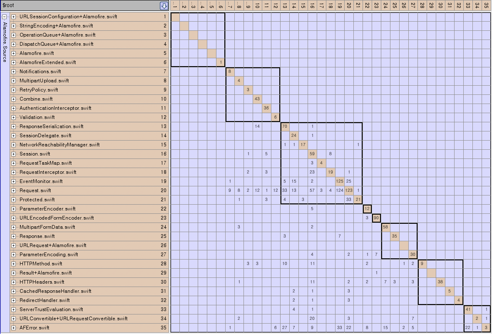

# swift-depends

## Overview
The ***swift-depends*** is a static analysis tool for finding dependencies of Swift code. 
This tool takes the source code as input, creates SIL(Swift Intermediate Lanaguage) of AST(Abstract Syntax Tree) form 
with Swift frontend and then analyzes the components and dependency relationship of between source codes through it.

## Usage

### 1. Configure own your swift project setting at swift-depends.config file.  

Example: swift-depends.config
```bash
TARGET=x86_64-apple-ios14.3-simulator
SDK_ROOT=/Applications/Xcode.app/Contents/Developer/Platforms/iPhoneSimulator.platform/Developer/SDKs/iPhoneSimulator14.3.sdk
PROJECT_SOURCE_ROOT=/work/PROJECT
XCCONFIG_FILE_PATH=/work/ios/Pods/Target Support Files/Pods-PROJECT/Pods-PROJECT.debug.xcconfig
PODS_ROOT=/work/ios/Pods
PODS_CONFIGURATION_BUILD_DIR=/Users/Library/Developer/Xcode/DerivedData/Build/Products/Debug-iphonesimulator
PODS_XCFRAMEWORKS_BUILD_DIR=/Users/Library/Developer/Xcode/DerivedData/Build/Products/Debug-iphonesimulator/XCFrameworkIntermediates
PODS_TARGET_SRCROOT=/work/ios/Pods/PromisesObjC
BRIDGING_HEADER=/work/ios/PROJECT/Classes/PROJECT-Bridging-Header.h
OBJC_HEADER_SEARCH_PATH=/Users/work/web/platforms/ios/PROJECT/Plugins
OTHER_FRAMEWORK_SEARCH_PATH=/Users/work/ios/PROJECT/Libraries
```

### 2. Create a list of swift file to be analyzed  
Example: source_list
```bash
/work/ios/ViewModel/OrderDeviceListViewModel.swift
/work/ios/ViewModel/OrderSupportModelNameViewModel.swift
/work/ios/Repository/OrderRepository.swift
/work/ios/Repository/OrderAPI.swift
/work/ios/Coordinator/OrderCoordinator.swift
/work/ios/Model/SupportModelName.swift
```

### 3. Run swift-depends
```bash
java -jar swift-depends.jar -n {$PROJECT_NAME} -i {$SOURCE_LIST} -o {$OUTPUT_DIR} 
```

Usage: swift-depends    
> -h,--help           : Give this help list  
> -i,--input <arg>    : Enter a target sources(*.swift) path to analyze  
> -n,--name <arg>     : Enter project name  
> -o,--output <arg>   : Enter the path to save the results. If you don't enter the path, analysis result will save at ./result/$TIMESTAMP

### 4. Create Lattix Architect Project with swift-depends output file(.xlsx)
1) Run Lattix Architect  

2) Create Project Option
   - Profile: All
   - Module Type: Excel
   - Hierachy Delimeiter Character: /

Example:  

